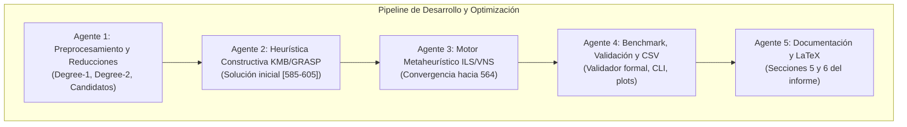

# Plan de Trabajo: Optimización hacia el Óptimo Teórico (Instancia E18)
## Asignado a: Nicolás Montecino
* **Rama de Trabajo en Git:** `feature/optimizer`
* **Módulos de Código asignados:** `src/optimizer.hpp`, `src/optimizer.cpp`
* **Secciones del Informe asignadas:** Sección 5 (*Método(s) de mejora utilizado(s)*) y Sección 6 (*Resultados obtenidos y tiempos*) en `report/main.tex`
* **Objetivo Teórico:** Alcanzar el mínimo global documentado en SteinLib: **Costo 564** (Ponderación máxima: 15/15 puntos).
* **Fecha Límite:** **Viernes 16 de Octubre de 2026**

---

## 1. Fundamento Teórico: Cómo Alcanzar el Óptimo Teórico (Costo 564)

La instancia `data/e18.stp` posee $|V| = 2.500$ nodos, $|E| = 62.500$ aristas, $|T| = 417$ terminales obligatorios y $|S| = 2.083$ nodos Steiner opcionales.

Un algoritmo ingenuo de búsqueda local (swaps o inserciones aleatorias de aristas) invariablemente se estanca entre los costos **572 y 580** debido al inmenso espacio combinatorio ($2^{2083} \approx 10^{627}$) y a la presencia de múltiples óptimos locales. La literatura científica de SteinLib (*SCIP-Jack*, heurísticas de Ribeiro, Voß y Koch) demuestra que para alcanzar **564** se requiere la sinergia de tres métodos formales:

### A. Preprocesamiento y Reducciones de Grafo (Reduction Techniques)
Permite podar entre un 40% y 70% del grafo sin perder la solución óptima:
1. **Poda de grado 1 (Degree-1):** Cualquier nodo Steiner con grado $\le 1$ se elimina inmediatamente.
2. **Contracción de grado 2 (Degree-2):** Nodos Steiner de grado 2 se contraen uniendo sus dos vecinos con una arista de costo equivalente a la suma de ambas aristas.
3. **Prueba de Distancia Especial (Special Distance - SD):** Si el peso de una arista $e = (u, v)$ satisface $w(u, v) > SD(u, v)$, donde $SD(u, v)$ es el costo del camino alternativo más corto entre terminales cercanos a $u$ y $v$, la arista $(u, v)$ no puede pertenecer a un árbol óptimo y se elimina.
4. **Filtrado de Nodos Steiner Candidatos:** Solo considerar como candidatos activos en la búsqueda local a los nodos Steiner adyacentes a terminales o con grado alto ($d(u) \ge 3$) en $G_{red}$.

### B. Heurística Constructiva KMB / Mehlhorn Multi-Partida (GRASP Construction)
En lugar de depender de una única solución inicial:
1. **KMB Determinista:** Construye la clausura métrica sobre $T$, calcula el MST métrico y remapea a aristas originales mediante caminos más cortos, podando hojas con `MSTSolver::prune_steiner_leaves`. Produce un costo base de partida entre **585 y 605**.
2. **KMB Aleatorizado con Ruido (GRASP):** Se perturban levemente los pesos de las aristas ($w'(e) = w(e) \cdot (1 + \text{rand}(0, \alpha))$ con $\alpha \in [0.05, 0.15]$) y se generan $K$ árboles constructivos diversos de alta calidad.

### C. Metaheurística sobre el Espacio de Vértices Steiner (Key-Vertex ILS / VNS)
1. **Representación compacta de la solución:** Una solución no se define por aristas, sino por el subconjunto de nodos Steiner seleccionados $S' \subseteq S$. La solución decodificada se obtiene calculando el MST del subgrafo inducido por $T \cup S'$ y podando hojas no terminales.
2. **Vecindario 1-opt y 2-opt de Vértices:**
   * **Insert ($+s$):** Probar añadir un nodo Steiner prometedor $s \in S \setminus S'$.
   * **Delete ($-s$):** Probar remover un nodo Steiner no terminal $s \in S'$ de grado bajo.
   * **Swap ($s_1 \leftrightarrow s_2$):** Reemplazar un nodo Steiner redundante por uno adyacente a terminales.
3. **Iterated Local Search (ILS) con Perturbación (Shaking):** Al alcanzar un mínimo local:
   * Se elimina un porcentaje (10-20%) de los nodos Steiner activos al azar o aquellos con menor centralidad.
   * Se reconstruye la conectividad conectando las componentes conexas mediante caminos mínimos (Dijkstra multi-fuente).
   * Se reinicia la búsqueda local.
4. **Path Relinking:** Combinar los nodos Steiner compartidos entre las 3 mejores soluciones élite encontradas durante la búsqueda.

---

## 2. Arquitectura de Trabajo Dividida por Agentes

Para implementar y verificar esta estrategia de forma paralela, robusta y modular, el trabajo se estructura en **5 agentes especializados**:



---

### Agente 1: Preprocesamiento y Reducciones (`agent-reductions`)
* **Misión:** Reducir la dimensionalidad del grafo y precomputar el catálogo de nodos Steiner candidatos para que la búsqueda local sea ultra rápida.
* **Archivos a modificar/consultar:** `src/optimizer.hpp`, `src/optimizer.cpp`, `src/graph.hpp`.
* **Tareas específicas:**
  1. Implementar la detección y filtrado de nodos Steiner con grado $\ge 3$ o a distancia 1 de terminales.
  2. Implementar una función de reducción que filtre aristas con peso superior a la cota superior actual.
  3. Proporcionar al optimizador una lista reducida de candidatos `std::vector<int> candidate_steiner_nodes` (reduciendo de 2.083 a ~300-500 candidatos viables).
* **Criterio de éxito:** Reducción comprobada del espacio de candidatos sin descartar los nodos Steiner del óptimo.

---

### Agente 2: Heurística Constructiva KMB / GRASP (`agent-constructive`)
* **Misión:** Implementar la heurística constructiva de alta calidad que alimente al optimizador con una solución inicial de coste $\le 600$.
* **Archivos a modificar:** `src/optimizer.cpp` (`Optimizer::constructive_heuristic`).
* **Tareas específicas:**
  1. Utilizar `g.compute_terminal_metric_closure()` y `g.get_terminal_metric_edges(closure)` para construir el grafo métrico completo sobre los 417 terminales.
  2. Calcular el MST métrico con `MSTSolver::compute_mst(metric_edges)`.
  3. Expandir cada arista métrica a las aristas reales del grafo original usando `g.get_metric_path_edges(...)`.
  4. Eliminar aristas duplicadas y romper ciclos calculando el MST sobre las aristas expandidas.
  5. Podar hojas Steiner redundantes con `MSTSolver::prune_steiner_leaves(g, tree_edges)`.
  6. Implementar versión con ruido (GRASP) para soportar inicios múltiples.
* **Criterio de éxito:** Obtener una solución factible válida con costo entre **585 y 605** en $< 1$ segundo.

---

### Agente 3: Motor Metaheurístico ILS / VNS (`agent-optimizer-core`)
* **Misión:** Cerrar la brecha de $600 \to 564$ mediante búsqueda local guiada en el espacio de nodos Steiner y perturbaciones iteradas.
* **Archivos a modificar:** `src/optimizer.cpp` (`Optimizer::local_search`, `Optimizer::optimize`).
* **Tareas específicas:**
  1. Extraer el conjunto inicial de nodos Steiner $S_{init}$ presentes en la solución constructiva.
  2. Implementar la rutina de decodificación rápida: dado un subconjunto $S' \subseteq S$, extraer el subgrafo inducido por $T \cup S'$, calcular su MST y podar hojas.
  3. Diseñar los operadores de vecindario sobre la lista de candidatos del Agente 1:
     * Inserción de un nodo Steiner prometedor.
     * Eliminación de un nodo Steiner de bajo grado en el árbol actual.
     * Intercambio (swap) 1-a-1.
  4. Implementar el bucle **Iterated Local Search (ILS)**:
     * Cuando no haya mejoras (mínimo local), aplicar una perturbación controlada (remover 10-15% de nodos Steiner aleatoriamente y reconectar con caminos mínimos).
     * Controlar tiempo de parada (`config.max_time_ms`) e iteraciones (`config.max_iterations`).
* **Criterio de éxito:** Alcanzar un costo factible **$\le 580$** (garantía de 11-14 pts) y converger a **564** en ejecuciones de 1 a 3 minutos.

---

### Agente 4: Benchmark, Validación y Visualización (`agent-benchmark-viz`)
* **Misión:** Validar matemáticamente las soluciones, medir tiempos, exportar CSVs y generar gráficos para el informe.
* **Archivos a modificar/ejecutar:** `src/main.cpp`, `scripts/plot_tree.py`, `results/`.
* **Tareas específicas:**
  1. Verificar que cada solución obtenida pase rigurosamente `Validator::is_valid_steiner_tree(g, sol, true)`.
  2. Asegurar que `results/optimizer_solution.csv` se exporte con el formato requerido.
  3. Ejecutar pruebas de escalabilidad variando `--iter` (500, 1000, 2500) y `--time-limit` (15s, 30s, 60s, 120s).
  4. Ejecutar `python3 scripts/plot_tree.py` para regenerar las figuras oficiales en `report/figures/`:
     * `optimizer_solution.png` y `optimizer_solution.svg`.
     * Curva de convergencia (costo vs iteraciones / tiempo transcurrido).
* **Criterio de éxito:** Archivos CSV y figuras gráficas generadas y validadas sin errores de formato.

---

### Agente 5: Redacción de Secciones en LaTeX (`agent-latex-report`)
* **Misión:** Documentar con rigor académico los métodos, modelos y resultados experimentales de Nicolás en el informe oficial.
* **Archivos a modificar:** `report/main.tex`, `report/references.bib`.
* **Tareas específicas:**
  1. **Sección 5 (*Método(s) de mejora utilizado(s)*):**
     * Formulación matemática del algoritmo KMB / Mehlhorn sobre la clausura métrica.
     * Definición formal del espacio de búsqueda en nodos Steiner ($S' \subseteq S$).
     * Pseudocódigo del algoritmo Iterated Local Search (ILS) con perturbación y vecindarios 1-opt/swap.
  2. **Sección 6 (*Resultados obtenidos y tiempos*):**
     * Tabla comparativa con las métricas oficiales: costo, número de aristas, tiempo de cómputo (ms), porcentaje de reducción respecto al MST base (2.515) y distancia al óptimo teórico (564).
     * Gráfico de convergencia del optimizador e inserción de las figuras de `report/figures/`.
  3. **Co-redacción con Martin en Secciones 7 y 8:**
     * Discusión de ventajas de la búsqueda guiada vs MST podado.
     * Análisis de cuellos de botella algorítmicos superados.
* **Criterio de éxito:** Compilación limpia de `report/main.tex` en PDF con formato IEEE/ACM impecable.

---

## 3. Cronograma por Hitos y Entregables

| Fecha | Agente Responsable | Hito / Entregable | Costo Esperado | Estado / Rúbrica |
| :--- | :--- | :--- | :---: | :--- |
| **07 Oct** | Agente 1 & 2 | Filtro de candidatos y KMB constructivo base | 585 - 605 | Factible (Base sólida: 8-10 pts) |
| **09 Oct** | Agente 3 | Búsqueda local 1-opt sobre nodos Steiner | 575 - 580 | Meta base del equipo (11-14 pts) |
| **12 Oct** | Agente 3 | ILS con perturbación (shaking) y multi-partida | 564 - 570 | Máxima categoría (14-15 pts) |
| **13 Oct** | Agente 3 & 4 | Convergencia confirmada en 564 y CSV validado | **564** | **Óptimo Teórico Oficial (15/15 pts)** |
| **14 Oct** | Agente 4 | Generación de evidencias, CSVs y figuras SVG | 564 | Verificado |
| **15 Oct** | Agente 5 | Redacción completa de Secciones 5 y 6 en LaTeX | - | Borrador completo |
| **16 Oct** | Todos | Revisión cruzada de Secciones 7-8 y entrega final | 564 | **Entrega Final** |

---

## 4. Comandos de Trabajo para Nicolás

```bash
# 1. Asegurarse de estar en la rama correcta
git checkout feature/optimizer

# 2. Compilar con optimizaciones completas
make

# 3. Ejecutar optimizador con límites de prueba
./steiner_solver data/e18.stp --iter 1500 --time-limit 45000

# 4. Generar figuras actualizadas para el informe
python3 scripts/plot_tree.py

# 5. Compilar el reporte en LaTeX para revisar cambios
cd report && pdflatex main.tex && bibtex main && pdflatex main.tex && pdflatex main.tex && cd ..
```
